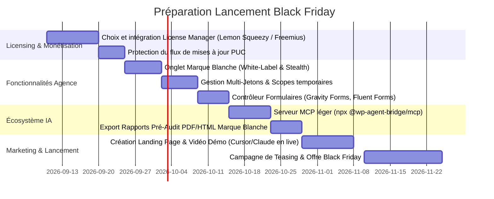

# 🗺️ Roadmap Commerciale & Technique — WP Agent Bridge (Spécial Agences & Black Friday)

> **Objectif Stratégique** : Positionner et packager **WP Agent Bridge** comme l'outil d'inspection et de diagnostic IA incontournable pour les agences web et les développeurs WordPress / WooCommerce, avec un lancement sous forme de **Licence Lifetime (LTD)** pour le Black Friday.

---

## 🎯 Vision & Proposition de Valeur "Agence"

### Le Pitch
> *"Fini les demandes d'accès SSH/FTP au client qui prennent 3 jours pour analyser un incident. Auditez, diagnostiquez et résolvez les bugs WordPress & WooCommerce en 30 secondes avec Claude, Cursor et Antigravity, sans aucun risque de casser le site en production."*

### Les 4 Piliers Inébranlables (Confiance, Sécurité & Performance)
1. **100% Lecture Seule (`GET` uniquement)** : Zéro risque de corruption de base de données ou de régression sur les sites clients (responsabilité civile de l'agence protégée).
2. **Conformité RGPD & Caviardage Automatique** : PII (emails, adresses clients) et secrets API (Stripe, SMTP, salts) masqués avant transmission aux LLMs.
3. **Protection Mémoire `fseek` & Anti-Brute Force** : Zéro risque d'épuisement mémoire et protection contre les abus de requêtes.
4. **Sobriété, Haute Efficacité & Zéro "Usine à Gaz"** : Le plugin reste un outil chirurgical, modulaire et ultra-rapide. Zéro tâche de fond lourde, requêtes SQL ciblées et légères, aucun ralentissement pour le site client.

### 🏆 Récemment Livré (Releases v1.7.0 à v1.9.0)
- ✅ **Base de Données & Autoload** : `GET /system/database` (taille BDD, top 15 tables, analyse surcharge autoload `wp_options > 800KB`, transients, Redis).
- ✅ **Crash Watch PHP** : `GET /logs/errors-summary` (détection ciblée `fseek` des erreurs fatales dédoublonnées avec attribution de composants).
- ✅ **Pages & SEO E-commerce** : `GET /content/pages`, `GET /content/seo-audit` (support produits & catégories), injection SEO dans `/woocommerce/product/{id}`.
- ✅ **Intelligence Commerciale 100% Native** : `GET /woocommerce/analytics/sales`, `/top-performers`, `/stock` (CA, AOV, % croissance N-1, valorisation catalogue, stock dormant sans dépendance tierce).
- ✅ **Diagnostics SMTP & Webhooks** : `GET /system/mail` (FluentSMTP, WP Mail SMTP, Post SMTP, échecs, alerte PHP mail) et `GET /woocommerce/webhooks` (topics, échecs >= 5).
- ✅ **Audit Durcissement Sécurité** : `GET /system/security` (constantes, XML-RPC, balise générateur, préfixe DB, plugins sécurité/cache).
- ✅ **Moteur de 8 Playbooks Procéduraux & Skill Generator** : `GET /capabilities?format=skill` (génération dynamique de `SKILL.md` pour Cursor, Antigravity et Claude).

---

## 🚀 Phase 1 : Les Incontournables Agences (Must-Have "Dealbreakers")

Ces fonctionnalités sont indispensables pour pouvoir vendre à des agences sans essuyer de refus immédiat.

### 1.1 Infrastructure Commerciale & Gestionnaire de Licences (LTD)
- [ ] **Système de Clés de Licence** : Intégration d'un moteur de licensing (ex. *Lemon Squeezy*, *Freemius*, *Appsero* ou *License Manager for WooCommerce*).
- [ ] **Validation & Activation API** : Endpoint d'activation / désactivation de site lié à la clé d'agence.
- [ ] **Distribution Sécurisée des Mises à Jour** :
  - Adapter `plugin-update-checker` (PUC) pour conditionner la réception des mises à jour automatiques à la validité de la licence.
  - Basculer les releases de code de production vers un flux d'artefacts d'update protégé (API / repo privé) tout en gardant la documentation publique.
- [ ] **Gestion des Quotas d'Activation** : Support des paliers de licences (5 sites, 25 sites, Illimité).
- [ ] **Révocation à Distance** : Pouvoir détacher un site d'une licence si le client quitte l'agence.

### 1.2 Marque Blanche Complète (White-Label & Stealth Mode)
- [ ] **Personnalisation de l'Identité** :
  - Renommage du plugin dans la liste des extensions (ex: *"MonAgence Diagnostic Core"*).
  - Personnalisation de l'auteur, de l'URL du site agence et de la description.
  - Remplacement ou masquage de l'icône de menu.
- [ ] **Mode Furtif (Stealth Mode)** :
  - Masquer l'onglet de menu `Settings > Agent Bridge` pour les utilisateurs non super-administrateurs.
  - Protection d'accès au panneau via constante `wp-config.php` (ex: `define('WP_AGENT_BRIDGE_STEALTH', true);`) ou paramètre d'URL secret.
  - Option de verrouillage pour empêcher la désactivation accidentelle du plugin par le client.
- [ ] **Nettoyage des Références Externes** : Masquage conditionnel des liens GitHub et contacts de support dans l'interface lorsque le mode Marque Blanche est activé.

### 1.3 Gestion Multi-Développeurs & Jetons d'Accès Scopés
- [ ] **Jetons Multiples Nommés** :
  - Remplacement du jeton unique global par un tableau de jetons étiquetés (ex: *"Julien - Lead Dev"*, *"Audit Freelance Frontend"*, *"Bot Monitoring"*).
- [ ] **Dates d'Expiration** : Possibilité de créer des jetons temporaires avec expiration automatique (ex: 7 jours, 14 jours, 30 jours) pour les prestataires externes.
- [ ] **Permissions / Scopes par Jeton** :
  - Possibilité de restreindre un token à un sous-ensemble de modules (ex: lecture seule sur `theme` et `content`, mais interdiction stricte de `woocommerce/orders` et `logs`).
- [ ] **Révocation Granulaire** : Révoquer un collaborateur ou un prestataire en 1 clic sans invalider les accès des autres développeurs.
- [ ] **Traçabilité des Requêtes** : Attribution de chaque requête dans l'onglet des logs au jeton spécifique utilisé.

### 1.4 Support des Formulaires d'Agence (Gravity Forms, Fluent Forms, WPForms)
- [ ] **Nouveau Contrôleur REST `/forms`** :
  - Prise en charge des 3 extensions de formulaires les plus populaires en agence :
    - **Gravity Forms**
    - **Fluent Forms**
    - **WPForms**
    - *(En complément d'Elementor Forms déjà supporté)*.
- [ ] **Cartographie des Intégrations** :
  - Liste des formulaires actifs avec champs et IDs.
  - Détection des flux de notifications (adresses emails de routage).
  - Détection des webhooks et intégrations CRM (HubSpot, ActiveCampaign, Mailchimp, Zapier).

---

## ⚡ Phase 2 : Les "Game Changers" Spécifiques à l'IA

Ces fonctionnalités créent un effet "Whaou" immédiat chez les développeurs utilisant Cursor, Claude Code ou Antigravity.

### 2.1 Connecteur Natif MCP (Model Context Protocol)
- [ ] **Serveur MCP Dédié (`@wp-agent-bridge/mcp`)** :
  - Package npm léger exécutable via `npx` (ex: `npx wp-agent-bridge-mcp --url=https://client.com --token=...`).
  - Configuration en 1 clic dans `claude_desktop_config.json` et Cursor MCP Settings.
- [ ] **Outils MCP Prêts à l'Emploi** :
  - `wp_health_check` : diagnostic global instantané.
  - `wp_get_recent_errors` : extraction sans surcharge des dernières erreurs fatales.
  - `wp_get_theme_overrides` : détection des conflits de templates WooCommerce.
  - `wp_get_order_diagnosis` : audit complet d'une commande avec notes de passerelle de paiement.

### 2.2 Générateur de Packs de Démarrage IA & Règles Cursor
- [ ] **Export One-Click `.cursorrules` & `.windsurfrules`** :
  - Téléchargement d'un fichier de configuration prêt à déposer à la racine d'un workspace local.
- [ ] **Skill Antigravity / Claude Projects Generator** :
  - Déjà initié avec `/capabilities?format=skill`, à packager sous forme de fiche projet copiable en 1 clic.

### 2.3 Rapports de Pré-Audit Marque Blanche (PDF / Markdown)
- [ ] **Générateur de Rapport Client** :
  - Compilation des données `/system/database`, `/system/security`, `/system/mail`, `/content/seo-audit` et `/woocommerce/analytics/sales`.
  - Export sous forme de document exécutif propre (Markdown et HTML imprimable en PDF A4) avec le logo de l'agence.
  - Cas d'usage : Permet à l'agence de livrer un pré-audit complet à un prospect dès la première prise de contact.

### 2.4 Indicateur d'Environnement (Staging / Production / Local)
- [ ] **Détection `WP_ENVIRONMENT_TYPE`** :
  - Détection automatique et exposition dans `/ping` et `/system`.
  - Badge visuel dans l'admin WordPress (Vert: Production, Orange: Staging, Bleu: Local).
  - Instruction claire à destination des agents IA pour adapter leur niveau de prudence.

---

## 🔬 Phase 2.5 : Diagnostics Techniques & Audits Métier Spécialisés

Ces évolutions fonctionnelles et techniques, identifiées lors de l'audit architectural, renforcent les capacités d'investigation sans aucune dépendance à des plugins tiers :

### 2.5.1 Audit SEO & Contenu Approfondi
- [ ] **Audit des Images sans Balise `alt` (`GET /content/seo-audit?include_images=true` ou `/content/media-audit`)** :
  - Calcul du ratio d'images sans texte alternatif dans la bibliothèque de médias (`_wp_attachment_image_alt`).
  - Détection ciblée des fiches produits WooCommerce dont l'image principale ou la galerie manquent de balise `alt` (pénalisant pour Google Images et non conforme aux standards d'accessibilité RGAA/WCAG).
- [ ] **Vérification du Sitemap XML et du Robots.txt (`GET /content/sitemap-status`)** :
  - Contrôle d'accessibilité et code HTTP du sitemap XML (`/wp-sitemap.xml` natif de WordPress ou sitemaps générés par Rank Math, Yoast, SEOPress).
  - Analyse des directives du `robots.txt` virtuel WordPress pour repérer les blocages accidentels (`Disallow: /` sur un site de production).
- [ ] **Hiérarchie Sémantique des Titres Hn** :
  - Enrichissement de `GET /content/page/{id}` et `/content/post/{id}` avec le décompte et l'arborescence des balises `<h1>` à `<h6>`.
  - Alertes automatiques en cas d'absence de `<h1>`, de `<h1>` multiples, ou de sauts de niveau incohérents (ex: passer directement de `<h2>` à `<h4>`).

### 2.5.2 Performance Frontend & Core Web Vitals
- [ ] **Cartographie des Assets CSS/JS & Scripts Tiers (`GET /system/assets`)** :
  - Inspection de `$wp_scripts` et `$wp_styles` pour inventorier tous les fichiers enfilés (*enqueued*).
  - Détection des scripts bloquants chargés dans le `<head>` (`in_footer == false`) sans attribut `defer` ou `async`.
  - Recensement des trackers tiers injectés (Google Tag Manager, Pixel Meta, TikTok, scripts WPCode en en-tête) impactant directement le First Contentful Paint (FCP) et le Interaction to Next Paint (INP).

### 2.5.3 Santé Système & Compatibilité PHP Avancée
- [ ] **Détection des Dépréciations PHP 8.2 / 8.3 (`GET /system/deprecations`)** :
  - Scan ciblé dans `debug.log` pour extraire les avertissements `E_DEPRECATED` récurrents causés par d'anciens snippets WPCode ou de vieilles extensions lors d'une montée de version PHP.

### 2.5.4 E-Commerce & Intégrations Externes
- [ ] **Funnel de Panier & Taux d'Abandon (`GET /woocommerce/analytics/cart-funnel`)** :
  - Analyse des sessions actives dans `{$wpdb->prefix}woocommerce_sessions`.
  - Décompte des paniers en cours vs commandes finalisées (ratio de déperdition au checkout sans dépendance à GA4).
  - Détection et extraction des données de plugins de relance de panier répandus (CartBounty, AutomateWoo) si installés.
- [ ] **Webhooks Entrants & Logs Callbacks API (`GET /woocommerce/api-logs`)** :
  - Analyse des requêtes entrantes rejetées ou en erreur sur les endpoints `?wc-api=*` et l'API REST (callbacks Stripe, retours d'état transporteurs, synchronisations ERP).

---

## 🔮 Phase 3 : Évolutions & Écosystème Avancé

### 3.1 Nouveaux Page Builders d'Agence
- [ ] **Bricks Builder** : Inspection des templates Bricks, des conditions d'affichage et des classes globales (très populaire chez les agences orientées performance).
- [ ] **Divi** : Détection des layouts Divi Library et des modules utilisés.

### 3.2 Gestion de Flotte (Fleet Management)
- [ ] **CLI Fleet Profile (`cli/sync.js`)** :
  - Fichier de configuration multi-sites `sites.json` permettant de synchroniser l'ensemble du parc de clients d'une agence en une seule commande (ex: `node sync.js --site=client-a`).
- [ ] **Compatibilité MainWP / WP Umbrella** :
  - Possibilité de distribuer la configuration ou de centraliser les clés de licence via les plateformes de maintenance multi-sites.

---

## 💰 Modèle Économique & Packaging Black Friday (LTD)

### Proposition de Grille Tarifaire Lifetime Deal (Paiement Unique)

| Palier | Cible | Quota Sites | Prix Conseillé (LTD) | Fonctionnalités Clés |
| :--- | :--- | :--- | :--- | :--- |
| **Tier 1 : Freelance** | Développeur solo | **5 sites** | **59 $ – 79 $** | Tous les modules d'inspection, Playbooks, CLI sync, Redaction RGPD |
| **Tier 2 : Studio** | Petite agence | **25 sites** | **129 $ – 149 $** | + Gestion Multi-Jetons avec scopes & dates d'expiration |
| **Tier 3 : Agency Pro** | Agence Web | **Sites Illimités** | **249 $ – 299 $** | **+ Marque Blanche complète (White-Label)**, Serveur MCP natif, Générateur de rapports clients |

---

## 📅 Rétroplanning Indicatif d'Exécution (D'ici Black Friday)

